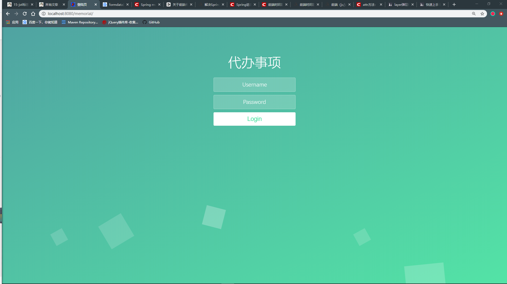
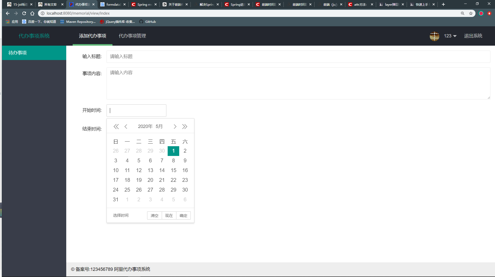
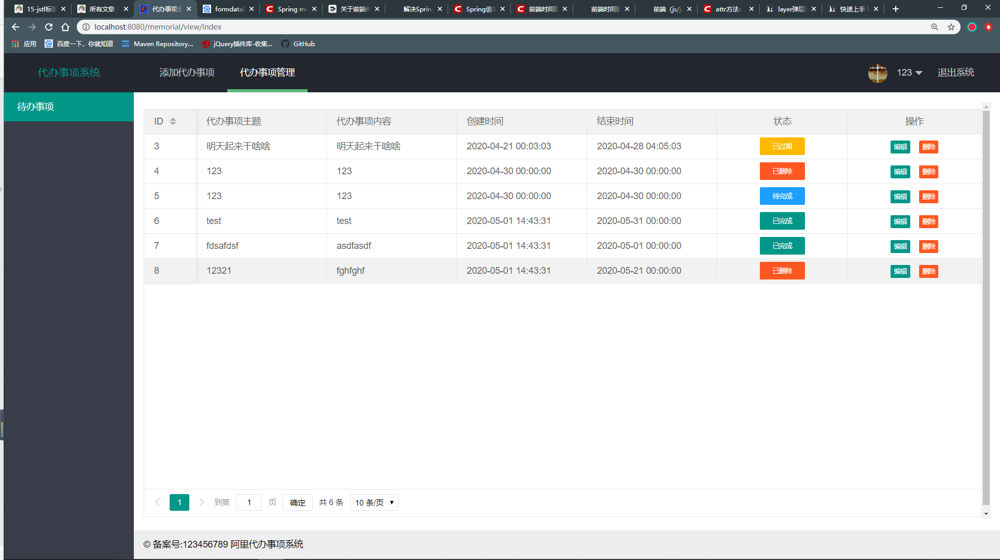
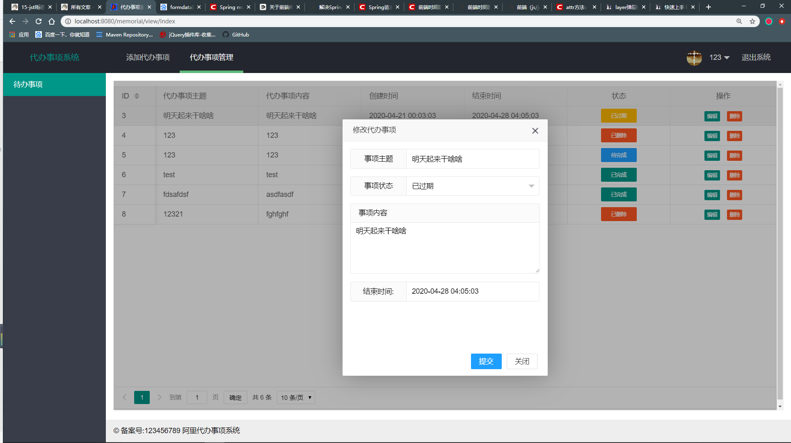
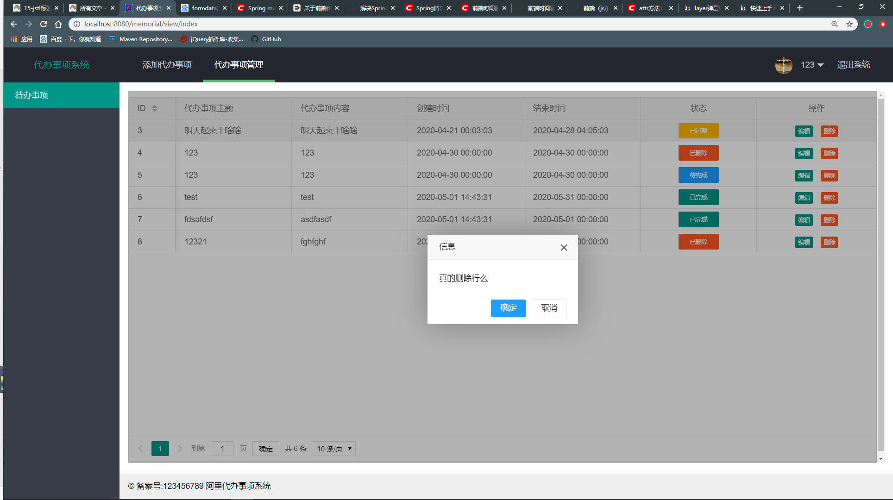

# memorial
### 基于ssm的代办事项管理系统

就是做了ssm整合的一个练手项目，有需要的自行下载练习

技术结构：
```
    前端：layui
    后端：springmvc+spring+mybatis
    数据库：mysql
    项目运行：jetty插件
``` 
由于项目没有写拦截器，所以一定要登陆才能进行操作，否则报错

项目截图展示：

### 1. 登陆界面


### 2. 添加代办事项界面


### 3. 查看代办事项


### 4. 修改代办事项


### 5. 删除代办事项
